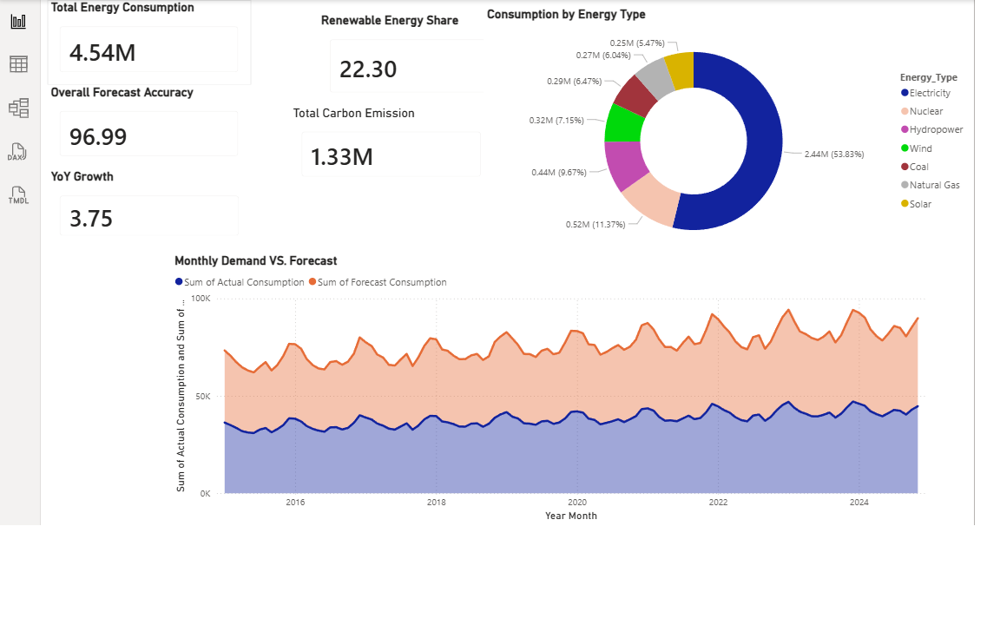

# ⚡ Energy & Utility Demand Forecasting Dashboard

## About This Project
This project is an interactive Energy & Utility Demand Forecasting Dashboard built in Microsoft Power BI, designed to analyze and visualize global energy consumption trends across 10 countries and 7 energy types from 2015 to 2024. The dataset was modelled after the Global Energy Consumption (2000–2024) dataset published on Kaggle by Atharva Soundankar (kaggle.com/datasets/atharvasoundankar/global-energy-consumption-2000-2024) and includes 8,330 records covering energy sources such as Electricity, Solar, Wind, Coal, Natural Gas, Hydropower, and Nuclear across major economies including the United States, China, India, Germany, Brazil, Japan, Canada, France, Australia, and South Africa. The dashboard was built using a structured Star Schema data model with one fact table (Fact_Energy) connected to three dimension tables (Dim_Country, Dim_Energy, Dim_Date) using Many-to-One relationships, following professional Power BI development standards. The report spans three pages — an Overview page featuring KPI cards, a demand vs forecast area chart, and an energy type donut chart; a Trends & Analysis page featuring a clustered bar chart, multi-line trend chart, and a renewable vs fossil stacked bar chart; and a Deep Dive page featuring a seasonal electricity heatmap, interactive slicers, and a scatter plot comparing consumption against carbon emissions.

## Key Findings
The dashboard reveals several important insights about global energy consumption and forecasting performance. First, the overall forecast accuracy across all records was 97% with a Mean Absolute Percentage Error (MAPE) of just 3%, confirming that the forecasting model performs at a highly reliable level suitable for real-world supply planning. Second, total energy consumption grew consistently year over year at approximately 3.75% annually, reflecting steady global demand growth driven largely by population growth and industrial expansion in Asia Pacific nations. Third, electricity dominates global energy consumption at 53.83% of total demand, dwarfing all other energy types combined, which highlights the critical importance of reliable electricity grid management and demand forecasting. Fourth, the renewable energy share stands at 22.3% of total consumption and is visibly growing every year in the stacked bar chart — Solar and Wind in particular show the steepest growth curves of any energy type, growing at roughly 12% annually compared to the global average of 2.5%, clearly reflecting the accelerating global green energy transition. Fifth, Coal is the only energy type showing a consistent decline, dropping approximately 1.8% per year as countries shift toward cleaner alternatives — this is most visible in the line chart where Coal is the only downward-sloping line from 2015 to 2024. Sixth, the seasonal heatmap reveals that the United States, China and Japan are the three highest electricity consuming nations by a significant margin, with China showing particularly strong growth in recent years, while South Africa and Australia consume significantly less, reflecting differences in population size, industrial activity and GDP. Finally, the scatter plot confirms a strong positive relationship between energy consumption and carbon emissions, with fossil fuel dependent nations clustering in the upper right quadrant, while nations with higher renewable or nuclear shares show relatively lower emissions despite significant consumption levels — demonstrating that energy mix matters as much as consumption volume when measuring environmental impact.

## Dashboard Pages
| Page | Visuals |
|---|---|
| Page 1 — Overview | KPI Cards, Area Chart, Donut Chart |
| Page 2 — Trends | Clustered Bar, Line Chart, Stacked Bar |
| Page 3 — Deep Dive | Heatmap, Slicers, Scatter Plot |

## Dataset Source
Global Energy Consumption (2000-2024) by Atharva Soundankar
https://www.kaggle.com/datasets/atharvasoundankar/global-energy-consumption-2000-2024

## Tools Used
- Microsoft Power BI Desktop
- Python (data preparation & generation)
- Microsoft Excel (data staging)

## How to Open
1. Download Power BI Desktop free from microsoft.com
2. Download the .pbix file from this repository
3. Open it in Power BI Desktop
4. All data is pre-loaded — no additional setup needed

## Files in This Repository
| File | Description |
|---|---|
| Energy_Demand_Forecasting_Dashboard.pbix | Main Power BI dashboard file |
| Energy_Demand_Forecasting_PowerBI.xlsx | Pre-processed Excel data file |
| energy_powerbi_prep.py | Python script used to generate the dataset |
